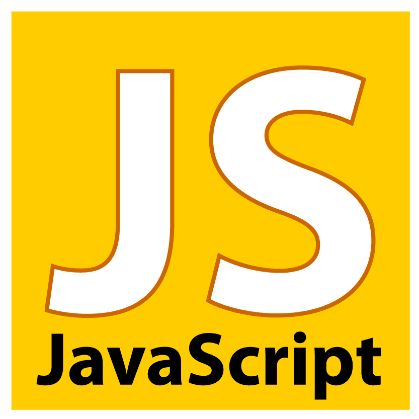

Coming into ICS 314, I had only learned Java, C, and C++. I first learned Java in my AP Computer Science class, and did very well in that class. It was the same when I took ICS 211. When I took ICS 212, I found C and C++ to be quite difficult for me. I took that class a long time ago, and it was the last time I had actually coded something until now, so I wasn't feeling very confident in jumping right back into it by learning a new language, let alone multiple. However, perhaps due to its similarity to Java - my strongest language - JavaScript is seeming to come much easier to me. 

Starting to code again honestly scared me at first. Since it's been so long, I was worried that my skills had declined heavily. However, from simply doing the practice WODs, I can see that I at least haven't completely forgotten how to code. I'm definitely rusty, but I'm remembering concepts I learned with each time I write some code. The syntax of JavaScript seems pretty similar to Java, so I think I won't have much trouble with that, but getting used to things like variables not needing a type or being less restrictive than variables in Java in general will take some getting used to, even more time to optimize. And as always, I'll have to improve my skills enough in order to make better design choices (like trying not to use nested for loops).

It hasn't even been two weeks of ICS 314 and I'm already struggling, so I think it will take a while to get back to my "top form". However, I hope that I'll be able to "get in the groove" so that I'll be as motivated as I was back then to reach new heights in my programming skills.
