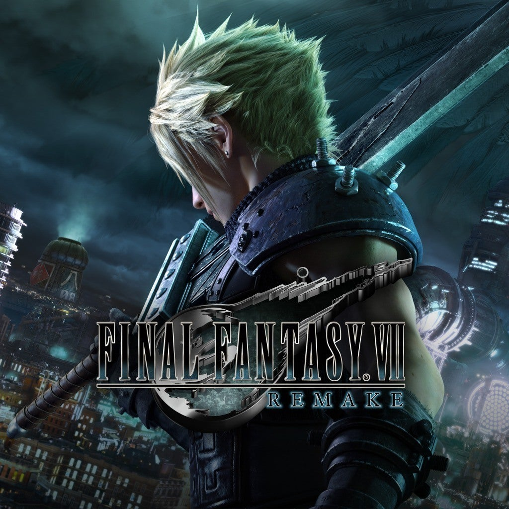

  

The assignment was to make an RPG where a user could create their character by choosing a class (Assassin, Mage, Tank, etc.) and inputting their name. Each character had health, attack, defense, and speed stats, and operated similarly to Pokémon, where the user could choose to run from an enemy or attack them. There are multiple bosses and a leveling system - after you defeat an enemy, you level up and gain stat boosts. This was a very big project and we learned how to give a user multiple options and be creative.
